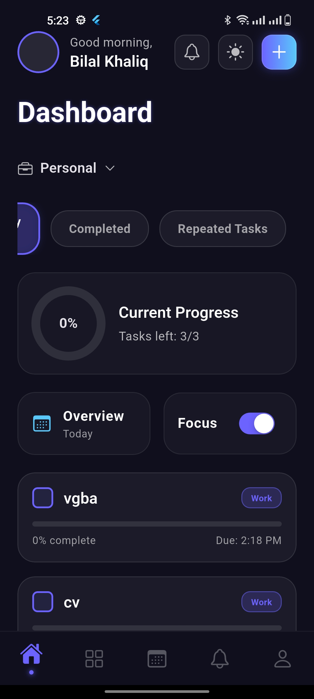
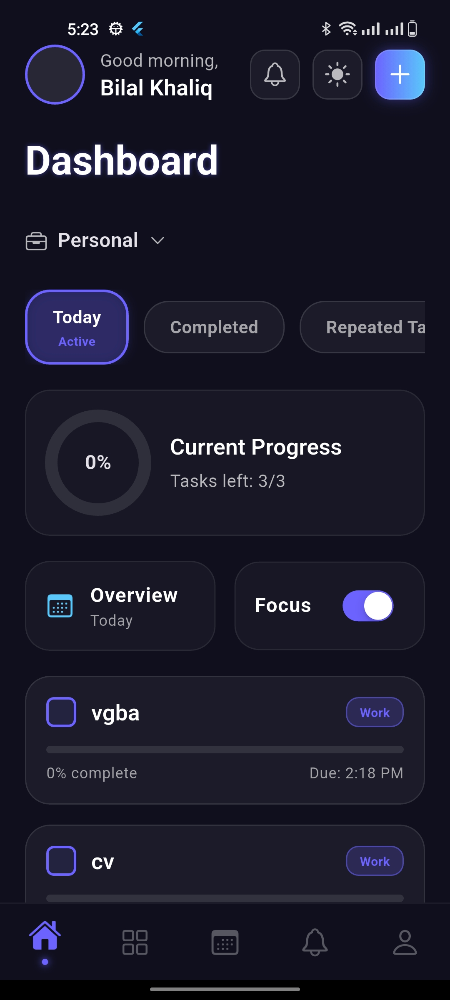

# 📱 Reminder Task App

A simple and user-friendly Flutter application designed to help users manage daily tasks and reminders efficiently.

---

## 👩‍🏫 Instructor

**Mam:** Ghulam Fatima

## 👩‍🎓 Student Information

**Name:** Bilal Khaliq

---

## 📌 Project Description

This Flutter-based application helps users organize their daily tasks and set reminders. It provides a clean interface and essential features to improve productivity and task management.

---

## ✨ Features

* ➕ Add new tasks
* 📝 Edit tasks
* ❌ Delete tasks
* ⏰ Set reminders
* 📋 View all tasks
* 🎯 Simple and clean UI

---

## 🛠️ Technologies Used

* Flutter
* Dart
* Android Studio / VS Code

---

## 🚀 Getting Started

### Installation

```bash
git clone https://github.com/khaliqbilal/ReminderTask.git
cd ReminderTask
flutter pub get
flutter run
```

---

## 📂 Project Structure

```
lib/
android/
ios/
web/
```

---

## 📸 Screenshots

### 🖼️ App Screens

#### Screen 1



#### Screen 2



---

## 📖 Learning Outcomes

* Understanding Flutter widgets
* UI design in Flutter
* Task management logic
* Handling user interaction

---

## 🤝 Acknowledgment

Special thanks to **Mam Ghulam Fatima** for guidance and support.

---

## 📄 License

This project is for educational purposes only.
